# `arman@github:~$ profile`

  

  

<table>
  <tr>
    <td valign="top"></td>
    <td valign="top"></td>
  </tr>
</table>

 

`arman@github:~$ ls ~/projects`

| Project | What it is | Status |
|---|---|---|
| 🧠 [BCI Robotic Arm](https://github.com/Armankothariya/BCI-Robotic-Arm-Project) | Emotion-aware EEG → ML → device-control research | Research / paper |
| 📍 VenueIQ | Geospatial venue intelligence for event planning, resource estimation and cost prediction | Building |
| 🕵️ Case404 | Detective / critical-thinking simulation game | Building |
| 🧬 Multimodal AI | Text + image → UI/code systems | Research / engineering |

 

`arman@github:~$ whoami`

> B.Tech Information Technology · CHARUSAT · Class of 2027
>
> AI/ML builder focused on Brain–Computer Interfaces, multimodal AI, and applied intelligent systems.

[Portfolio](https://armankothariya.github.io/) · [LinkedIn](https://www.linkedin.com/in/armankothariya) · [GitHub](https://github.com/Armankothariya)

<!--
First-time setup:
1. Put your portrait at ./source-photo.jpg
2. python -m venv .venv
3. Activate it and install: pip install -r scripts/requirements.txt
4. python scripts/prep_photo.py source-photo.jpg
5. python scripts/make_ascii_svg.py
6. python scripts/make_info_card.py
7. python scripts/fetch_contributions.py
8. python scripts/render_heatmap_svg.py

The daily workflow only needs requests + beautifulsoup4, but keeping one
requirements file makes local setup simpler.
-->
